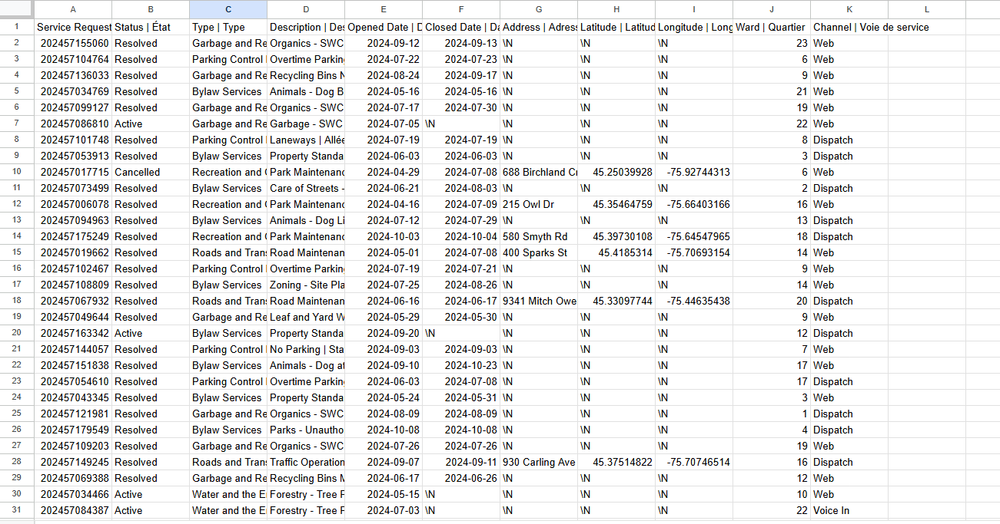
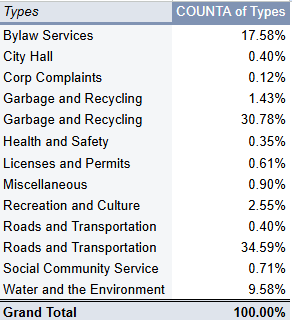
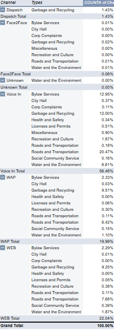
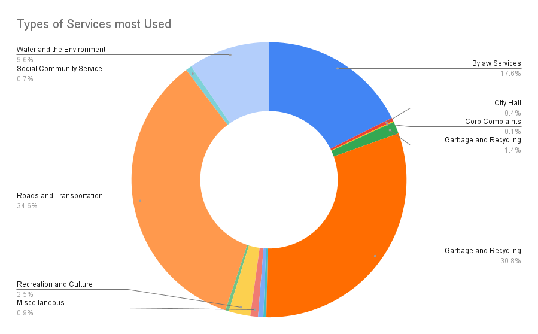

**November 4, 2024**<br>
**MPAD2003 Introductory Data Storytelling**<br>
**Sebastien Perrault**<br>
**Presented to Jean-Sébastien Marier**<br>

# Midterm Project: Exploratory Data Analysis (EDA)


## 1. Introduction

In this assignment I will be analyze the dataset from the City of Ottawa about the the different request of service toward the City Staffs. The datasets holds different information on a variety of different request to the city, such for Garbage and Recycling or the road and Transpotation. The datasets were made from the collectives from many community wide services across the city but any information from private request  such as the address have been removes as it holds personals information on a individual and has been removed for their safety. In this Assigment I will first get the data and important in Google Sheet, then I will be cleaning the dataset. Once the data has been clean I will be doing a exploring data analysis. After that anylise I would then try to conclude what potential story can be made  and final make a summerar of my thoughts on the analysis.

 [*Link to Google Sheet*](https://docs.google.com/spreadsheets/d/10j0XsLmab5ytJgidytjkednaiHeZ3SJrtMqBFr_DlZA/edit?usp=sharing)

 [*Link to Open Ottawa*](https://open.ottawa.ca/documents/65fe42e2502d442b8a774fd3d954cac5/about)

## 2. Getting Data
In order to import that data in Google Sheet, I first need to go find the dataset on Open Ottawa, and then copied the file link. I then imported the CSV file in google sheets. The Dataset held information on the different types of service request made across the city from observing the dataset I was able to see that their was up to 11 columns depictings the different assortment of data. On the other case the amount of data that was procude had was place in up to around 273843 rows if I remove the first row. Looking at the data I will need to removes some data as I only need to have data in one language for my analysis as I can see that it has it information in both french and english. I can also see that their is still quite on bit of information missing such as in the column of the address, longitude and latitude as only the public request types are shown and all information that once held personal information have been removed. When first looking at the dataset I was surprise to see how the vast majority of the request were private request. The column C features the types of service that was request to the city staff. While column D includes the description on what the service request was need. We are also able to look at Column K to figures how the service request was made if it was by a voice call or on the website. When looking at this Dataset, I found myself wandering why there is so many request of services have been made just from the city of Ottawa itself.


<br> 
*Figure 1: The "Import file" prompt on Google Sheets.*

**Functions Used in Google Sheet:**

``` r
=IMPORTData("https://311opendatastorage.blob.core.windows.net/311data/311opendata_lastyear.csv")
```

## 3. Understanding Data

### 3.1. VIMO Analysis

When Looking at the I can see that their that many cells of data under the columns Longitude, latitude, Address, Closed Data, or some cell in Wards hold the Value that are Invalid. The value that are invalid all held the same Value \n but the value is not a possibility for those columns, we were able to determine that some of those value have been remove as it hold private information.


### 3.2. Cleaning Data

During the process of cleaning the data, the first method that I used was the google sheet data-ckeaning tool so that I would be able to find if there was any whitespace or duplicates, but it came it didn’t anything as there was no duplicates or whitespace to removes. I then frozen the first rows so that I could keep each category on the screen. I then removed the columns that I believe would be of no use for me so I remove the colum of longitude, latidute and the Addresses. I then try to used the different fonctions such as SPLIT or CONCATENATE. I first used the fonction split in order two separate the english and french data in the Columns fo Types then I delete the french version. I then notice that not every cells was transferred and some were now blank so then I return to the google sheets tools and used the find and replace all blanks spots with the appropriate cells. In order to know what cells need to be replaces I add the addition of the filters tool  from google sheets in order to know what value need to be place in which row by using the filter of the description rows.

``` r
=SPLIT(C2;"|")
```

### 3.3. Exploratory Data Analysis (EDA)

After I finish cleaning the Datasset, I then started on the exploration data Analysis. The first thing I did was create two different types of Pivot tables, the first using the categories of types in order to figures out what types of service request are being requests the most. After that I create another Pivot table in order to figures what channel the request are being made the most with the addition of how much each different types of Channels are being used in the different Types of service request. After creating the first Pivot table I was able to see that the types of service request being requested the most to the least. As an example the Garbage and Recycling service request is the most request with around 34,99% from the total amount of service request. I even went a create a pie chart to see how much of a different each types of service have from each other, and the Garbage and Recycling taking almost a around third of it. A potential story with this would be able tell a story about a volume analysis on what types of request are being made the most and it might ever show a problem of recurrence as to why the service of Garbage and Recycling is the most request service in the city of Ottawa. I would be able to do a similar stories on which channel are being used the most such as Voice call are the channel being the most used in order to make a service request to the city of Ottawa  with a Value of 56,48% of the total value. In both cases the values that were given to used showcased the different between the different Chanels or the different Types as I could ever give a indication that their might be a recurrent problem surfacing, or being able to find why a specife channel is most recurring and if its the most effectives.

**Screen capture of my pivot table:**

<br>
*Figure 2: This pivot table shows the percentage of each types being requested.*

<br>
*Figure 3: This pivot table shows the percentage of Channels most used in total and in Types.*

**Screen capture of my exploratory chart, like so:**

<br>
*Figure 3: This exploratory chart shows the comparison of each types of requested being made.*

## 4. Potential Story

The potential story that can be made from this dataset, would be that what types of service are prones to be request from what chanel, or even what servest is prone to have more request. In this way would could figured out pattarnes in problems that keep resurfacing the city, in the dataset their are dates of when the resques are made, we could potential find during what time of the yeas certain service are more prone to happens. When looking at the dataset we can see that type of service most request is Garbage and recycling, from here, I might have the possibility to ask the question why is the most requested, is their a  reason for, such as a backlog, or recurring problems that keep happening. I would then be  able to see if I could potentially go and ask the people in charge of it such as a city consollor. I was reading article that spoke about how their is going to be changes in th payment of garbage services, and that ottawa, has one lows fees comparated to others city, form there I wonderede, Could the amount of request for it have been one of the reason, for that changes (Skura, 2024).

## 5. Conclusion

During this analysis I found the part that was most challenging was figuring out how I should clean the data as when there was so many rows of Data, As when I was using the split function for explemple, my google sheet kept crashing or when I need to makes sure to copie and paste the data after using the function, I need to figures out a bit on how to make sure everysingle cells retain the data it need. From their I notice that some of the data, didn’t keep but i was thankfull able to rewrite them as i was able to check what went missing by looking at the other columns and rows. Anothe part I found challenging was trying to figured out what type of potential stories that could come of of the datasets, as all the other time we have done it we mostly did it as a groupe or the dataset was smaller as I found just reading the datasets as a whole was already quite hard.  Although during this whole assignment I quite like that i got to experience and how to start a analysis as it not something I have done before.  One thing I know I wished i did different was to double checked that might commit actually got push to github or even wished that I wasn’t with my time management.

## 6. References


Skura, E. (2024, June 8). *How we pay for garbage service in Ottawa could soon change*. CBC. [https://www.cbc.ca/news/canada/ottawa/how-we-pay-for-garbage-service-in-ottawa-could-soon-change-1.7228492](https://www.cbc.ca/news/canada/ottawa/how-we-pay-for-garbage-service-in-ottawa-could-soon-change-1.7228492)


[Jean-SéBastien Marier]. (2021, October 9). *Cleaning Data in Google Sheets [Video]*. Youtube. https://www.youtube.com/watch?v=U4yigiawIEU 

[Jean-SéBastien Marier]. (2021, October 19). Using Pivot Tables in Google Sheets [Video]. Youtube. https://www.youtube.com/watch?v=cCVl0h-9HmU

[Jean-SéBastien Marier]. (2021, October 19). Basic Data Analysis Techniques [Video]. Youtube. https://www.youtube.com/watch?v=fuJA8cHN1jc